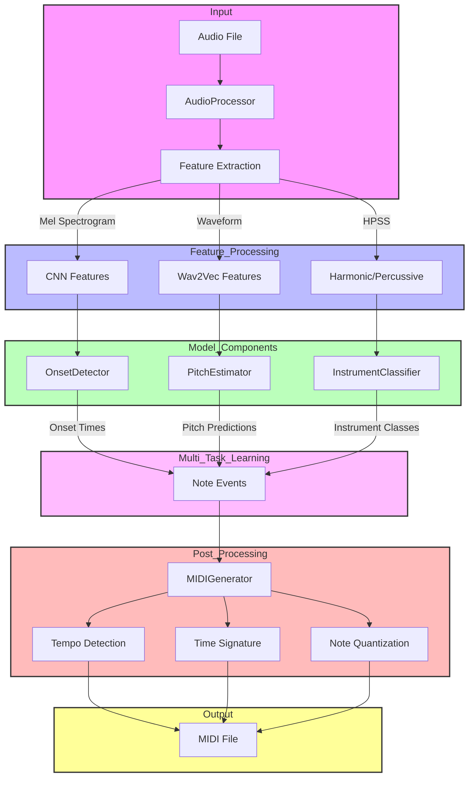
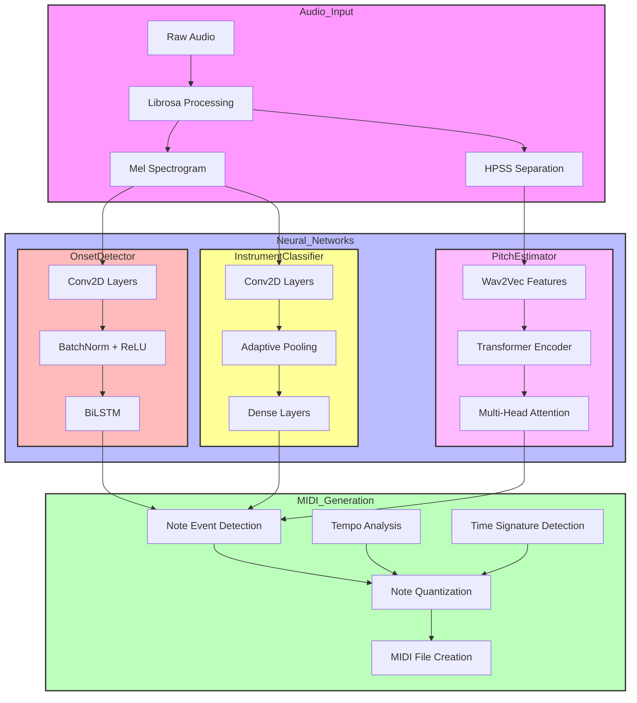

# AI Music Transcription Competition System

A deep learning system for automatic music transcription, optimized for the 2025 Automatic Music Transcription Challenge.

## Pipeline Overview



## Technical Architecture



## Features

- Multi-instrument transcription (up to 3 instruments simultaneously)
- Support for piano, violin, cello, flute, clarinet, trumpet, guitar, and drums
- Pitch range from C2 to C7 (MIDI notes 36-96)
- Tempo detection (40-200 BPM)
- Time signature recognition (4/4, 3/4, 6/8)
- Fast processing (< 6 seconds per recording)
- High accuracy onset detection and pitch estimation

## Requirements

- Python 3.9+
- CUDA-capable GPU (recommended)
- 16GB RAM (minimum)

## Installation

1. Clone the repository:
```bash
git clone https://github.com/yourusername/ai-music-transcription.git
cd ai-music-transcription
```

2. Create and activate a virtual environment:
```bash
python -m venv venv
source venv/bin/activate  # On Windows: venv\Scripts\activate
```

3. Install dependencies:
```bash
pip install -r requirements.txt
```

## Data Preparation

1. Organize your training data with matching audio-MIDI pairs:
```
data/
  ├── train/
  │   ├── piece1.wav
  │   ├── piece1.mid
  │   ├── piece2.wav
  │   └── piece2.mid
  └── val/
      ├── piece3.wav
      ├── piece3.mid
      ├── piece4.wav
      └── piece4.mid
```

2. Run the data preparation script:
```bash
python prepare_data.py data/train processed/train --config config/train.yaml
python prepare_data.py data/val processed/val --config config/train.yaml
```

This will:
- Validate audio files (sample rate, duration)
- Validate MIDI files (tempo, time signature, instruments, pitch range)
- Copy valid files to the processing directory
- Generate a processing report

## Training

1. Configure training parameters in `config/train.yaml`

2. Start training:
```bash
python train.py
```

The training script will:
- Initialize Weights & Biases logging
- Load and preprocess the dataset
- Train the model with the specified configuration
- Save checkpoints and logs
- Monitor validation metrics

Training progress can be monitored at [wandb.ai](https://wandb.ai).

## Model Architecture

The system uses a hybrid architecture combining:
- Self-supervised learning with wav2vec features
- CNN-based onset detection
- Transformer-based pitch estimation
- Multi-head instrument classification

Key components:
- Audio preprocessing with mel-spectrograms
- Multi-task learning for onset, pitch, and instrument detection
- Post-processing for MIDI generation

## API Usage

Start the FastAPI server:
```bash
uvicorn src.api.main:app --host 0.0.0.0 --port 8000
```

Send a transcription request:
```bash
curl -X POST "http://localhost:8000/transcribe/" \
  -H "accept: application/json" \
  -H "Content-Type: multipart/form-data" \
  -F "file=@piece.wav"
```

## Competition Metrics

The system is optimized for the following metrics:
- Note onset F1-score
- Pitch accuracy
- Instrument classification accuracy
- Processing time (< 6 seconds per recording)

## License

MIT License

## Citation

If you use this code in your research, please cite:

```bibtex
@software{music_transcription_2025,
  title = {AI Music Transcription Competition System},
  author = {Your Name},
  year = {2025},
  url = {https://github.com/yourusername/ai-music-transcription}
}
``` 